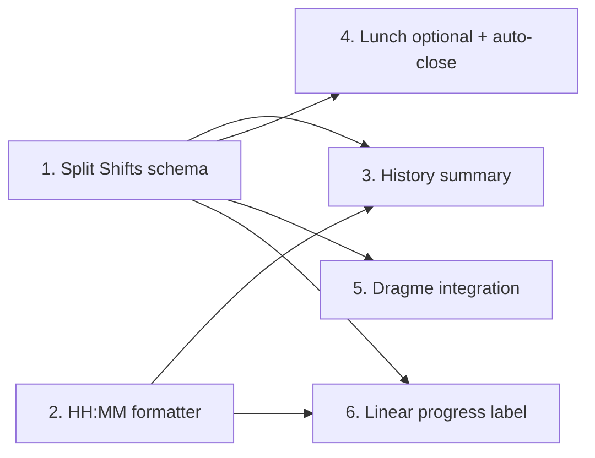

# TimeTrack Feature Enhancement Plan

Scope: 6 feature prompts. Security rules, rate limiting, and access controls are deferred until after functional completion (per user directive).

Primary files involved:
- [`src/app/lib/database.ts`](src/app/lib/database.ts:1) — schema + mapping
- [`src/app/components/employee/TodayEntry.tsx`](src/app/components/employee/TodayEntry.tsx:1) — check-in flow + Entry Complete screen
- [`src/app/components/employee/HistoryView.tsx`](src/app/components/employee/HistoryView.tsx:1) — history summary
- [`src/utils/timeCalculations.ts`](src/utils/timeCalculations.ts:1) — aggregation helpers
- [`firestore.rules`](firestore.rules:1) + [`firestore.indexes.json`](firestore.indexes.json:1) — deferred hardening

---

## 1. Split Shifts — Multiple Entries Per Day

Goal: allow N clock-in / clock-out pairs per calendar date.

Tasks:
1. Extend `TimeEntry` in [`src/app/lib/database.ts`](src/app/lib/database.ts:5) with a `segments: TimeSegment[]` array:
   - `TimeSegment = { id, clockInManual, clockInSystem, lunchOutManual?, lunchOutSystem?, lunchInManual?, lunchInSystem?, clockOutManual?, clockOutSystem?, skipLunch?, workMinutes?, complete }`.
2. Keep legacy top-level clock fields as **derived** (first+last segment) for back-compat during migration; add `mapEntry` logic to hydrate `segments` from legacy docs if absent.
3. Firestore doc id strategy: keep `uid_date`, store `segments` subarray. Add helper `getActiveSegment(entry)` returning the open (incomplete) segment or `null`.
4. In [`src/app/components/employee/TodayEntry.tsx`](src/app/components/employee/TodayEntry.tsx:50):
   - Remove the "already checked in today" block.
   - Replace single-entry state with `activeSegment` + `segmentsToday`.
   - Clock In action: if no active segment, append a new segment; else error.
   - Clock Out action: closes active segment and returns UI to "Ready to clock in again" state.
5. Recompute `totalWorkMinutes` = sum of all segments for the day on every write.
6. Update [`src/app/components/employee/HistoryView.tsx`](src/app/components/employee/HistoryView.tsx:60) rendering to iterate segments.
7. Write migration note in [`docs/operations/TIME_INTEGRITY_PLAN.md`](docs/operations/TIME_INTEGRITY_PLAN.md:1) (no live migration required; lazy upgrade).

Parallelizable with: #2, #6.

---

## 2. Time Formatting — Decimal → HH:MM

Goal: Replace decimal hour display in the Entry Complete totals.

Tasks:
1. Add `formatHoursHMM(decimalHours: number): string` to [`src/utils/timeCalculations.ts`](src/utils/timeCalculations.ts:1):
   - `const totalMin = Math.round(decimalHours * 60);`
   - `const h = Math.floor(totalMin / 60); const m = totalMin % 60;`
   - return `` `${h}:${String(m).padStart(2,'0')}` ``.
2. Replace all render sites of `totalHours.toFixed(2)` (or similar) in [`src/app/components/employee/TodayEntry.tsx`](src/app/components/employee/TodayEntry.tsx:1) Entry Complete section with the new formatter.
3. Also apply in History totals and Admin/Payroll display **only where user-facing** — keep raw decimals for CSV exports.
4. Add Jest tests in `src/utils/timeCalculations.test.ts` for edge cases (0, 0.5, 2.63→2:38, 9.999, 24.0).

Parallelizable with: #1, #3, #6.

---

## 3. History — Total Hours Header + Timestamp Rows

Tasks in [`src/app/components/employee/HistoryView.tsx`](src/app/components/employee/HistoryView.tsx:60):
1. After filtered `entries` is computed, derive `totalMinutes = entries.reduce((s, e) => s + (e.totalWorkMinutes ?? 0), 0)`.
2. Render a summary card at top of the list: date range + `formatHoursHMM(totalMinutes/60)` (depends on #2).
3. Replace the "Duration only" row with 4 columns: Date • Clock In • Lunch Out • Lunch In • Clock Out • Total. Use `clockInManual/System` (fall back to system if manual missing), formatted `h:mm a` in user TZ.
4. When split-shift `segments` exist (#1), render each segment as a nested row under the date.
5. Update the existing CSV export, if any, to include the same columns.

Depends on: #1 (segments), #2 (formatter).

---

## 4. Lunch Logic — Optional + Auto-Close Safety

Tasks:
1. Add `lunchRequired: boolean` (default true) to user settings collection + a toggle on the Today check-in screen ("Skip lunch today"). Persist `skipLunch` on the active segment (#1).
2. When `skipLunch` is true: hide Lunch Out / Lunch In steps in the [`ProgressStepper`](src/app/components/ui/progress-stepper.tsx:1); allow direct Clock Out.
3. Auto-close safeguard:
   - Add a client-side watchdog inside [`src/app/components/employee/TodayEntry.tsx`](src/app/components/employee/TodayEntry.tsx:50): `useEffect` that polls every 60s while an active segment exists.
   - If `now - clockInSystem > shiftMaxMinutes` (default 12h, configurable via user setting `maxShiftMinutes`) AND lunch-out recorded without clock-out → show modal "Auto-closing shift" and call Clock Out with timestamp capped at `clockInSystem + shiftMaxMinutes`.
   - Also add a Cloud Function stub in `functions/autoCloseShifts.ts` (or a Firestore scheduled trigger) for server-side closure when the tab is closed. Mark as "deferred — server component" in plan.
4. Flag `autoClosed: true` on the segment; HistoryView shows a badge.

Depends on: #1.

---

## 5. Dragme Integration

Tasks:
1. Create [`src/services/dragmeService.ts`](src/services/dragmeService.ts:1) exporting:
   - `fetchTasks(): Promise<DragmeTask[]>` — GET `${VITE_DRAGME_BASE_URL}/tasks` with `Authorization: Bearer ${VITE_DRAGME_API_KEY}`.
   - `syncEntry(params: { entryId, taskId, totalHours, date, userId }): Promise<void>` — POST `/time-entries`.
   - Typed interfaces `DragmeTask`, `DragmeSyncPayload`.
   - Uses `fetch` with AbortController + 10s timeout; retries 2x with exponential backoff.
2. Add env vars to [`vite.config.js`](vite.config.js:1) / `.env.example`: `VITE_DRAGME_BASE_URL`, `VITE_DRAGME_API_KEY`.
3. In [`src/app/components/employee/TodayEntry.tsx`](src/app/components/employee/TodayEntry.tsx:50):
   - Add `taskId` state + Task dropdown on the clock-in form, populated via `fetchTasks()` on mount (cached 5 min).
   - Persist `taskId` on the segment (#1).
   - On "Entry Complete" success, fire `syncEntry(...)`; show toast on failure with Retry.
4. Add `src/services/dragmeService.test.ts` with mocked `fetch`.
5. Rules hardening deferred.

Depends on: #1 (segment schema), #2 (hours formatting reused for display, not payload).

Parallelizable with: #6.

---

## 6. UI — Linear Horizontal Progress (replace counter-clockwise ring)

Tasks:
1. Identify the counter-clockwise element in the Entry Complete view of [`src/app/components/employee/TodayEntry.tsx`](src/app/components/employee/TodayEntry.tsx:1) (likely an SVG circle with `strokeDashoffset`).
2. Replace with the existing [`src/app/components/ui/progress.tsx`](src/app/components/ui/progress.tsx:1) primitive (Radix), value = `min(100, totalHours / targetHours * 100)`.
3. Layout: full-width bar with current `HH:MM` label left, `target HH:MM` right, percentage centered.
4. Add color states: < target → `bg-primary`; ≥ target and < OT → `bg-success`; ≥ OT threshold → `bg-warning`.
5. Remove now-unused SVG / CSS in component and any keyframes in [`src/app/styles/theme.css`](src/app/styles/theme.css:1).

Parallelizable with: #2, #5.

---

## Execution Order (recommended)

Phase 1 (parallel): #1 schema, #2 formatter, #6 progress bar.
Phase 2 (parallel after #1+#2): #3 history, #4 lunch logic, #5 Dragme.
Phase 3 (deferred): firestore.rules tightening, Dragme auth hardening, auto-close Cloud Function.

---

## Open Questions

1. Dragme API shape — do you have docs/endpoint spec, or should the service be written against a stub contract we finalize later?
2. Default max shift duration for auto-close — 12h OK or different?
3. Should split-shift segments be merged into one row in History, or shown as nested sub-rows?
4. Is the counter-clockwise ring also used on History/Admin views, or only Entry Complete?
